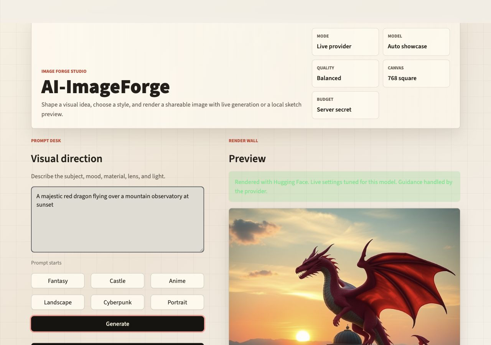

<div align="center">
  

  # AI-ImageForge

  A small image studio for turning prompts into polished visual drafts.
</div>



AI-ImageForge gives you two ways to work:

- `Sketch mode` renders a free local preview, useful when you just want to explore the interface.
- `Live provider` sends the prompt to Hugging Face Inference Providers and returns a real generated image.

It is built for a practical portfolio launch: run it locally, share it as a Streamlit app, and choose whether visitors use their own Hugging Face token or an owner-funded token. Recent renders are saved locally in `outputs/`, and live generation has a session limit so a public app is harder to drain by accident.

## Try It Locally

Requires Python 3.9 or newer.

### macOS or Linux

```bash
cd web-genAI
python3 -m venv .venv
source .venv/bin/activate
pip install -r requirements.txt
streamlit run app.py
```

Open `http://localhost:8501`.

### Windows

```bat
start.bat
```

Or run it manually in PowerShell:

```powershell
py -3 -m venv .venv
.venv\Scripts\Activate.ps1
pip install -r requirements.txt
streamlit run app.py
```

## Get Real Image Generation

Sketch mode works without any account. For live generation, create a Hugging Face token:

1. Sign in at `https://huggingface.co`.
2. Open `https://huggingface.co/settings/tokens`.
3. Create a token named something clear, for example `imageforge-local-test`.
4. Use `Read` for local testing. Use a fine-grained token for production if you want tighter control.
5. Copy the token once. It should start with `hf_`.

Do not paste your real token into chat or commit it to git.

Create `.streamlit/secrets.toml` locally:

```toml
HF_TOKEN = "hf_your_token_here"
IMAGEFORGE_PROFILE = "local"
ALLOW_LIVE_FALLBACK = "false"
ALLOW_SESSION_TOKENS = "true"
ALLOW_DEMO_MODE = "true"
LIVE_SESSION_LIMIT = "12"
MAX_LIVE_IMAGES = "1"
MAX_SKETCH_IMAGES = "4"
```

The real secrets file is ignored by git. Commit `.streamlit/secrets.example.toml` only.

Restart Streamlit, turn off `Sketch mode`, then click `Generate`. A successful live result will show `Hugging Face` as the source.

## Test Generation

Run the free local renderer first:

```bash
.venv/bin/python scripts/smoke_generation.py
```

Then verify live generation:

```bash
.venv/bin/python scripts/smoke_generation.py --live --quality Balanced --output outputs/smoke-live.png
```

The live smoke test reads `HF_TOKEN` from `.streamlit/secrets.toml`, the shell environment, or `--token`. Generated test images go into `outputs/`, which is ignored by git.

## Deploy

The easiest production path is Streamlit Community Cloud.

1. Push this repo to GitHub.
2. Open `https://share.streamlit.io`.
3. Create a new app from the repo.
4. Set the entrypoint to `app.py`.
5. Paste one of the secrets blocks below in Advanced settings.
6. Deploy, then run a Sketch test and a live test if a token is configured.

### Public Demo With No Surprise Bills

Visitors can explore Sketch mode for free. Users who want real images can enter their own session token.

```toml
IMAGEFORGE_PROFILE = "production"
ALLOW_LIVE_FALLBACK = "false"
ALLOW_SESSION_TOKENS = "true"
ALLOW_DEMO_MODE = "true"
LIVE_SESSION_LIMIT = "4"
MAX_LIVE_IMAGES = "1"
MAX_SKETCH_IMAGES = "4"
```

### Owner-Funded Live Generation

Visitors can generate live images without bringing a token. Usage may count toward the token owner's Hugging Face/provider quota.

```toml
HF_TOKEN = "hf_your_token_here"
IMAGEFORGE_PROFILE = "production"
ALLOW_LIVE_FALLBACK = "false"
ALLOW_SESSION_TOKENS = "false"
ALLOW_DEMO_MODE = "true"
LIVE_SESSION_LIMIT = "4"
MAX_LIVE_IMAGES = "1"
MAX_SKETCH_IMAGES = "4"
```

More deployment notes are in [DEPLOYMENT.md](./DEPLOYMENT.md).

## Models

The app currently exposes:

- `black-forest-labs/FLUX.1-schnell`
- `stabilityai/stable-diffusion-xl-base-1.0`
- `stable-diffusion-v1-5/stable-diffusion-v1-5`
- `prompthero/openjourney`

The default `Auto showcase` model uses `FLUX.1-schnell`. Through Hugging Face routing, that model currently uses provider-specific settings: Fast, Balanced, and Showcase map to `4`, `6`, and `12` steps, and guidance is omitted for compatibility.

## Project Map

```text
app.py                         Streamlit app and generation logic
scripts/smoke_generation.py    Local and live generation smoke tests
.streamlit/secrets.example.toml Shareable secrets template
DEPLOYMENT.md                  Deployment modes and launch checklist
assets/                        Logo and README screenshot
requirements.txt               Minimal runtime dependencies
```

## Useful Links

- Hugging Face tokens: https://huggingface.co/docs/hub/security-tokens
- Streamlit secrets: https://docs.streamlit.io/develop/api-reference/connections/secrets.toml
- Streamlit Community Cloud: https://docs.streamlit.io/deploy/streamlit-community-cloud/deploy-your-app/deploy
- Streamlit Cloud secrets: https://docs.streamlit.io/deploy/streamlit-community-cloud/deploy-your-app/secrets-management
